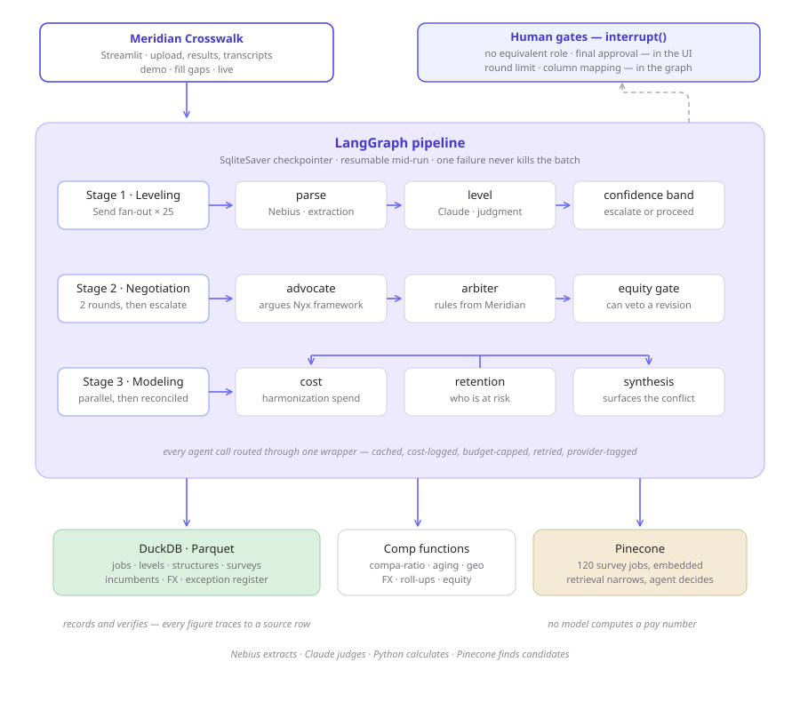

# Meridian Crosswalk

**A multi-agent system that maps an acquired company's workforce into your job architecture — and shows its reasoning for every placement.**

When an acquisition closes, the compensation team has ninety days to decide where several hundred people belong in a job architecture that isn't theirs. Titles don't line up, there's no level column in the file, and every answer breaks internal equity if it's wrong. Today it's three to four weeks of manual spreadsheet work.

This does it in minutes, and every decision cites the rule that governed it.

---

## The agent, in one line

> This agent helps a compensation manager map an acquired company's workforce into our job architecture, replacing the three to four weeks of manual leveling that follows every acquisition. It parses each employee's role from a messy census, levels it against our framework, and negotiates contested mappings between two incompatible frameworks on its own using six tools. It hands off to a human when a role has no equivalent, when the two sides can't agree after two rounds, and before any decision is written.

## Architecture



Three stages in a checkpointed LangGraph pipeline. Judgment runs on Claude, extraction on an open model via Nebius, and every calculation runs in deterministic Python.

---

## The interesting part: two frameworks that don't align

Meridian uses eight IC levels plus a manager track. Nyx Semiconductor — the acquired company — uses five, no manager track, plus a "Fellow" honorific outside the ladder entirely.

Five levels don't divide into eight, so every Nyx level straddles two Meridian levels. The ambiguity is structural, not a data quality problem.

The frameworks also disagree on substance. Meridian caps deep specialists who lack cross-domain breadth; Nyx doesn't — depth alone can carry someone to the top. So a genuine domain authority sits at the top of one ladder and a level lower on the other. Both frameworks are coherent. They reach different answers.

That's what the negotiation exists for:

```
crosswalk proposal → advocate (argues Nyx's framework)
                   → arbiter (rules from Meridian's, cites a rule by number)
                   → equity gate (can veto a revision)
                   → upheld | revised | red-circled | escalated
```

Two rounds maximum, then it escalates to a human. The advocate may only argue from evidence — **title, retention risk and current pay are rejected by schema validation before the argument reaches the arbiter.** Those are real concerns, but you solve them with money, not by moving someone's level.

---

## The agents

| Agent | Model | What it does |
|---|---|---|
| Parser | Nebius | Extracts structured evidence from free-text role descriptions. Never assigns a level. |
| Leveler | Claude | Applies the framework to that evidence, citing the governing rule and the level it rejected. |
| Advocate | Claude | Argues the acquired company's case from *their* framework. |
| Arbiter | Claude | Rules on contested mappings from ours. Splitting the difference is not an available verdict. |
| Equity gate | Claude | Checks revisions against existing employees. Can veto the arbiter. |
| Cost | Claude | Models harmonization spend, immediate and phased. |
| Retention | Claude | Identifies who lands underwater and who is a flight risk. |
| Synthesis | Claude | Reconciles cost and retention — surfaces conflicts rather than averaging them. |

## Where a human decides

| Gate | Fires when | Options |
|---|---|---|
| Column mapping | On upload, before ingest | Confirm or correct |
| No equivalent role | No match exists — photonics, the Fellow | Hand off, or map manually |
| Negotiation deadlock | Unresolved after two rounds | Decide, both positions shown |
| Final approval | Before any write | Approve or send back |

Manual mapping is constrained to job codes that actually exist — an override can't point at a combination that isn't real.

---

## Results

<!-- TODO: fill in from evals/results.md -->

| Measure | Result |
|---|---|
| Leveling accuracy, exact level | _/20 |
| Within one level | _/20 |
| Full 25-employee run, wall clock | _s |
| Cost per full run | $_ |
| Calls served by open models | _% |

## Notable findings

**An open model leveled one level high, confidently.** Routed first-pass leveling to Nebius and measured against Claude baselines: it landed one level high on four of five cases, at 0.85–0.95 confidence. No escalation threshold fixes that shape of error — the model isn't uncertain, it's wrong. Moved it to extraction, where agreement with Claude is near-total. In a compensation context this matters: a system that levels one high inflates the entire architecture and breaks equity against every existing employee.

**A cross-currency comparison produced a compa-ratio of 4.675.** Manager-versus-report pay checks compared raw local-currency figures across geographies, so an INR salary looked ~83× a USD one. Every function was correct; the missing piece was a domain constraint — inversion is a within-market check, never cross-geo. No test would have caught it.

**Confidence scores from an LLM are unstable; flags are not.** The same input returned 0.68 and 0.72 across runs, flipping a hard escalation threshold. Replaced it with a band: below 0.65 always escalates, above 0.75 never does, and in between it escalates only if the model named a specific ambiguity. Three runs varying 0.62–0.72 all escalated consistently.

**Adversarial variance is absorbed by a document-grounded arbiter.** The advocate is highly non-deterministic — it declined to contest about half the time and proposed anything from L7 to an invalid manager-track code. The arbiter ruled identically every time, citing the same rule, and rejected the invalid proposal on admissibility grounds. Grounding the adjudicator in a document rather than in the argument's quality is what makes the outcome stable.

---

## Stack

LangGraph · LangChain · Claude · Nebius Token Factory · Pinecone · DuckDB · Streamlit · Plotly · statsmodels · pytest

## Running it

```bash
git clone <repo-url>
cd meridian-comp-agents
pip install -r requirements.txt
cp .env.example .env        # add your keys
python data/generate.py     # build the synthetic company
streamlit run app/Home.py
```

The app defaults to **demo mode**, which replays cached responses at zero cost and needs no API key. Switch to **live** in the sidebar to make real calls, or **fill gaps** to warm the cache after a data change.

## Repo structure

```
agents/          leveling, negotiation, cost, retention, synthesis
tools/           deterministic comp functions — all tested
data/            seeded synthetic generator, Parquet outputs, Nyx census
app/             Streamlit pages
docs/            level frameworks, data model spec, architecture diagram
evals/           labeled cases and scoring
tests/           _ tests
```

## Everything here is synthetic

Meridian Silicon and Nyx Semiconductor are fictional. The employees, salaries and market data are generated.

That's deliberate: real compensation survey data is licensed and cannot be used in a system like this, and real employee data is confidential. The architecture, frameworks and compensation logic reflect how the work is actually done — the data underneath describes no one.

## On how this was built

Designed and specified by a compensation professional, implemented with AI coding tools. The leveling framework, the negotiation rules, the admissibility constraints and the labeled evaluation set are domain work. The Python is not.

Several bugs in this repo were caught by reading output as a comp practitioner rather than by reading code — the compa-ratio of 4.675, a manager pay ladder that silently used the wrong level equivalence, a "down-leveled into L8" explanation for a level that has nothing above it. All of them passed their tests.
